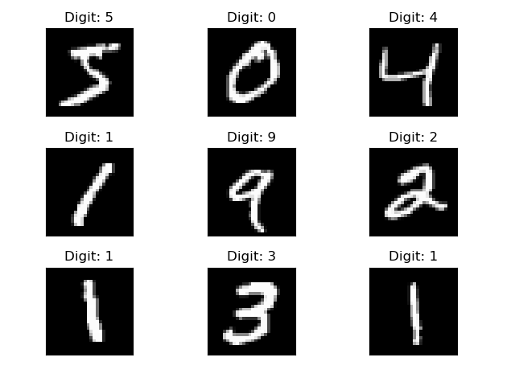
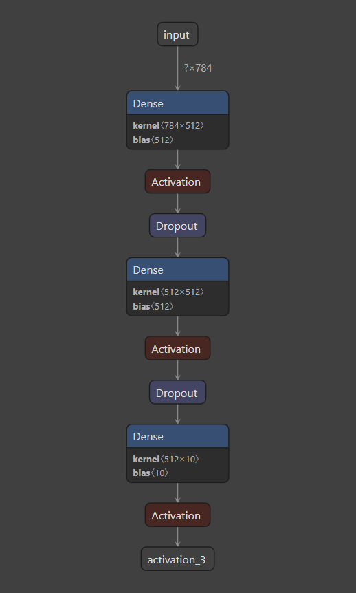

# MNIST-Hand-Written-Digit-Recognition
Hand Written Digit Recognition using Keras and PyTorch 

I have Implemented the Mnist Hand Written Dataset in Keras as well Pytorch
Two of the above folders contains each of the project implementatons respectively

## Below is the train image example

## Model
I have build a DNN(Deep Neural Network) model consisting of 2 hidden layer each with 512 neurons.
The model layouts looks like below

